# 📖 Table of Content

1. [Overview](#overview)
2. [Features](#features)
3. [Tech Stack](#️tech-stack)
4. [Installation](#installation)
5. [Usage](#usage)
6. [Screenshot](#screenshot)
7. [Live Demo](#live-demo)
8. [Contributors](#contributors)

## 📌Overview

Welcome to the **Hotel Management System**. This is a comprehensive application built to manage hotel bookings, room statuses, and guest information efficiently. The application is designed using Angular 18 and TypeScript, providing an intuitive interface and robust functionality for administrators.

## 🚀Features

- 🔐 **User Authentication** – Role-based access (e.g., admin, guest).
- 🏨 **Room Booking System** – Add, edit, and delete room details.
- 📅 **Booking Management** – Update booking statuses (e.g., pending, confirmed, checked-in, cancelled).
- 🛎️ **Guest Management** – Maintain guest records and preferences.
- 📅 **Reservation Tracking** – View and manage all upcoming bookings.
- 🔍 **Search & Filter** – Easily find rooms and bookings.
- 📊 **Reports & Analytics** – View room, booking status reports, track revenue, occupancy rates, and trends.

## 🛠️Tech Stack

- **Front-End**: Angular
- **Back-End**: TypeScript, Firebase Firestore.
- **Styling**: CSS, Angular Material UI
- **Database**: Firebase Firestore.
- **Software Tools**: Visual Studio Code, GitHub.

## 📦Installation

1. Clone the repository: git clone [https://github.com/Mncedisi95/firebase]
2. Install dependencies: npm install.
3. Start the development server: npm start.
4. Build and Deploy: npm run build and npm run deploy.
5. Switch to a specific branch: git checkout master
6. Pull changes from remote repository: git pull master
7. Run tests for the project: npm run test.
8. Run linter checks for code quality: npm run link.
9. Generate documentation for the project: npm run docs.

## 📜Usage

- 🔑 **User Authentication**: Sign up or log in using admin credentials or a guest account.
  - Example admin credentials:
    - Username: [admin@suitesync.com]
    - Password: SuiT@2025Sync!
- 🏨 **Room Management**: View all available rooms, add new rooms, and update existing room details.
- 📅 **Booking Management**: Manage all bookings, including confirming, canceling, and checking booking statuses.
- 👥 **Guest Management**: View and filter guest details based on roles or specific criteria.
- 🔍 **Search & Filter**: Easily find rooms and bookings using advanced filtering options

## 📸Screenshot

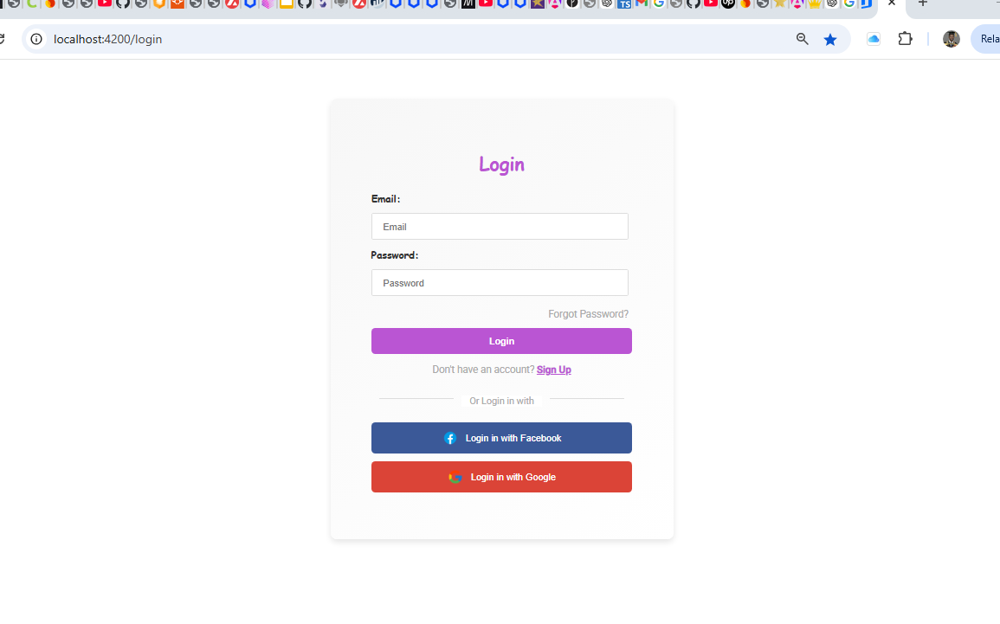
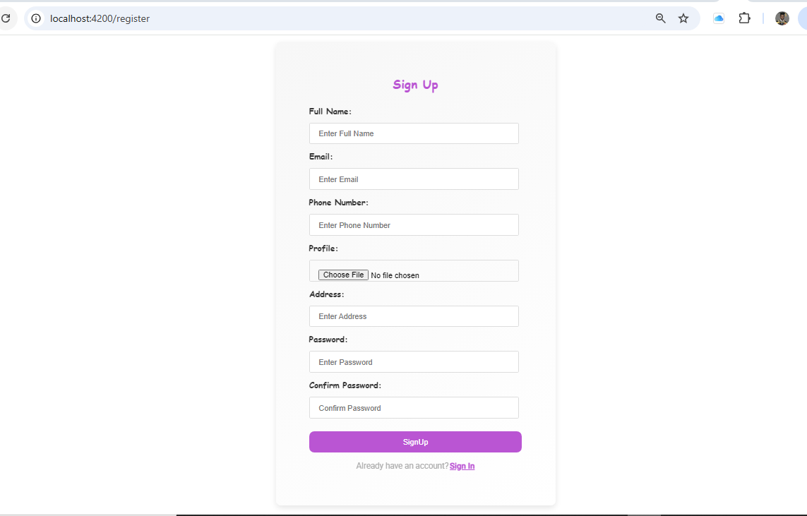
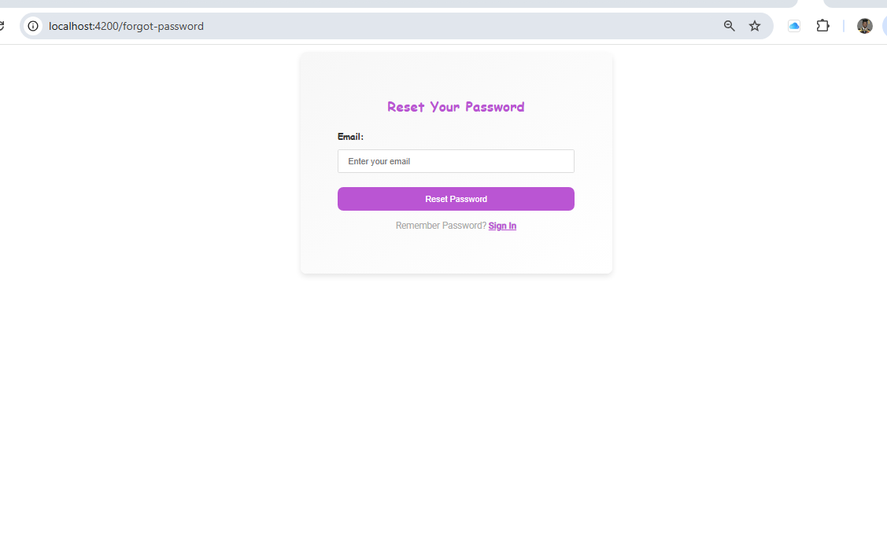
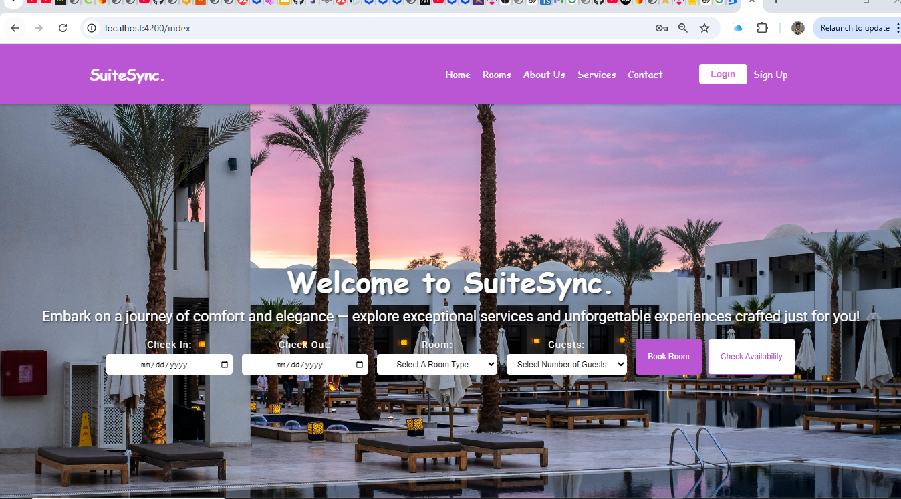
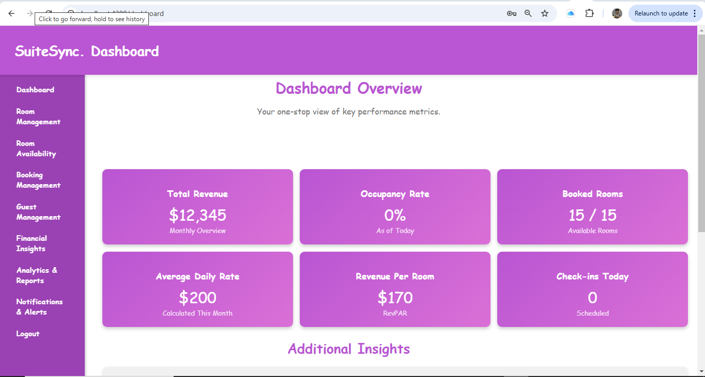
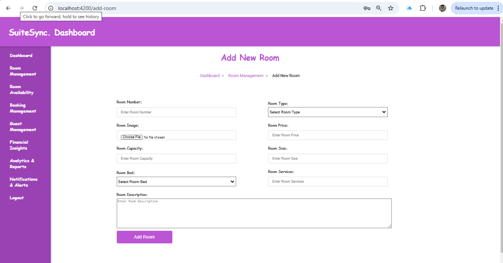
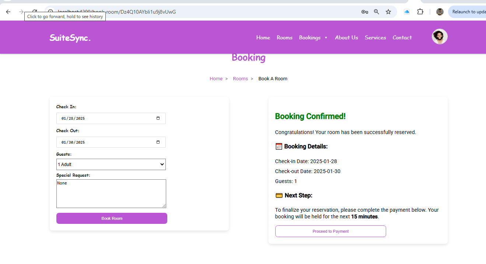
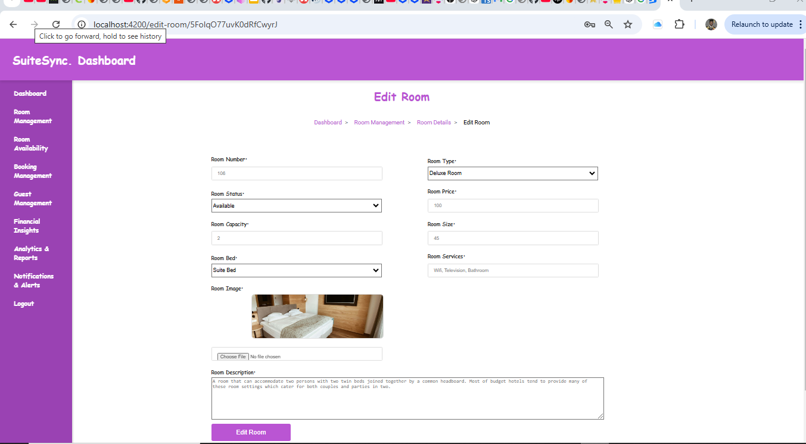

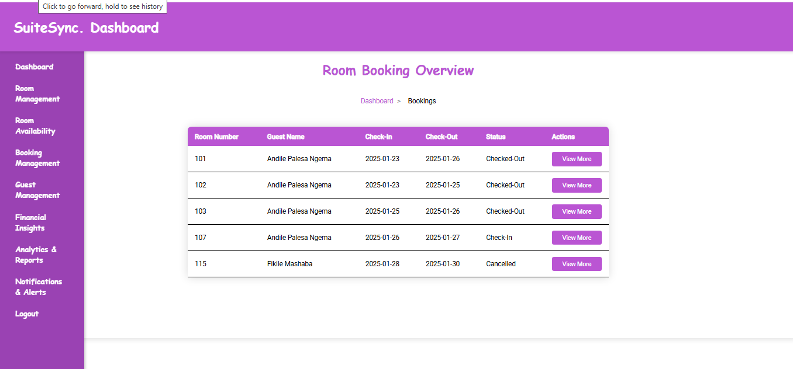
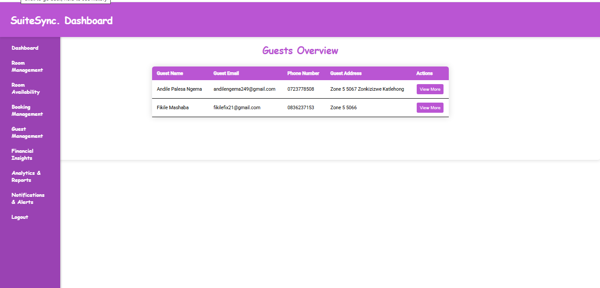
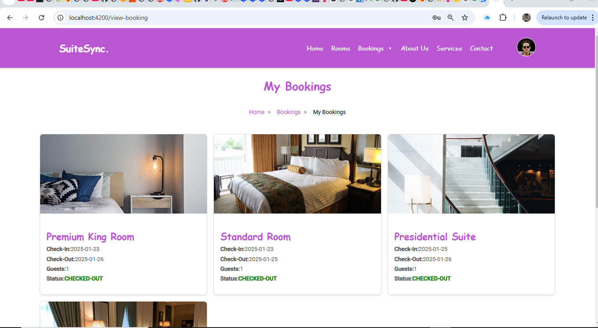

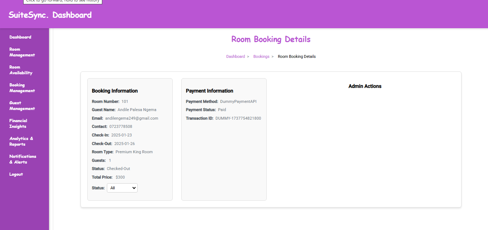inst
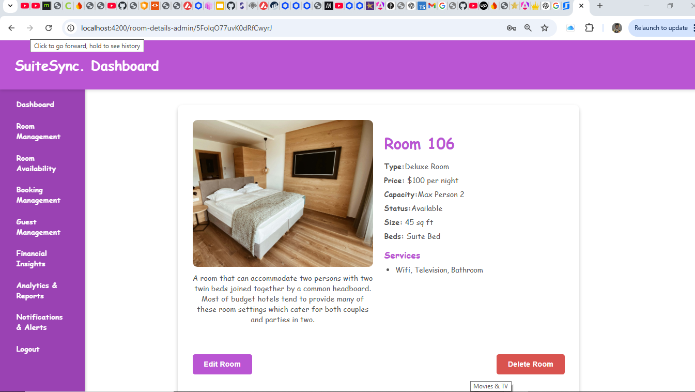
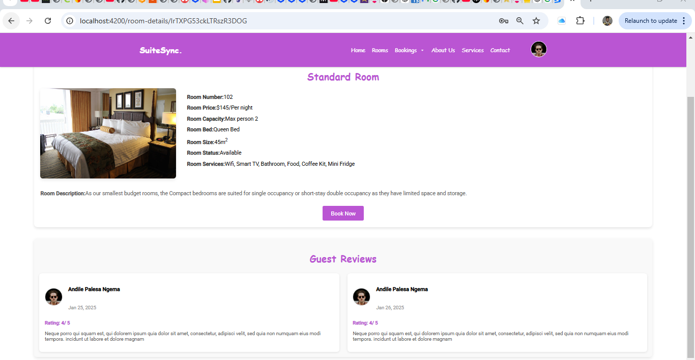

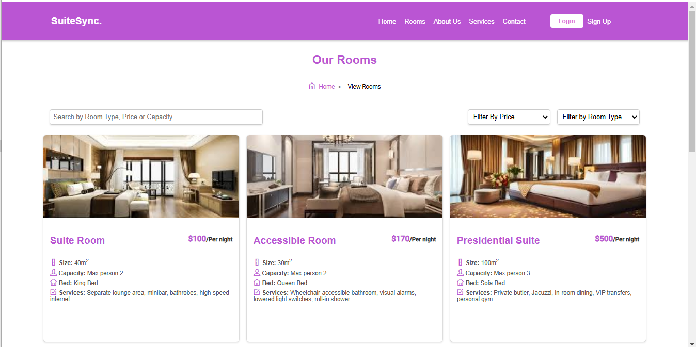
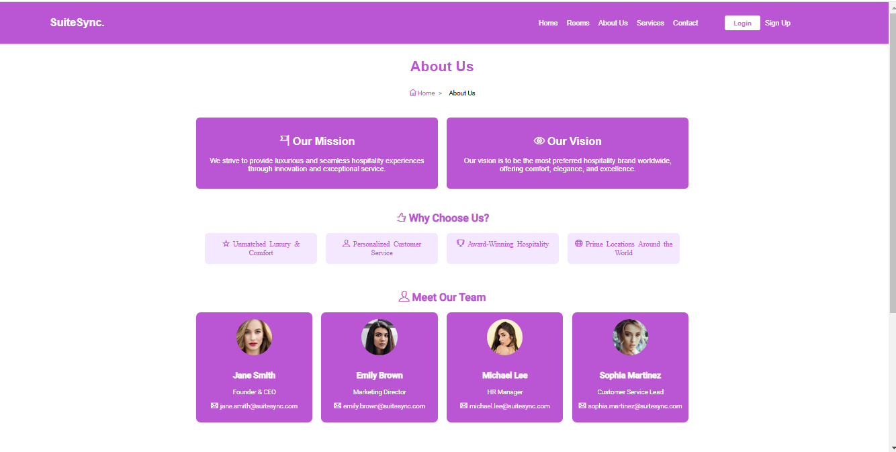
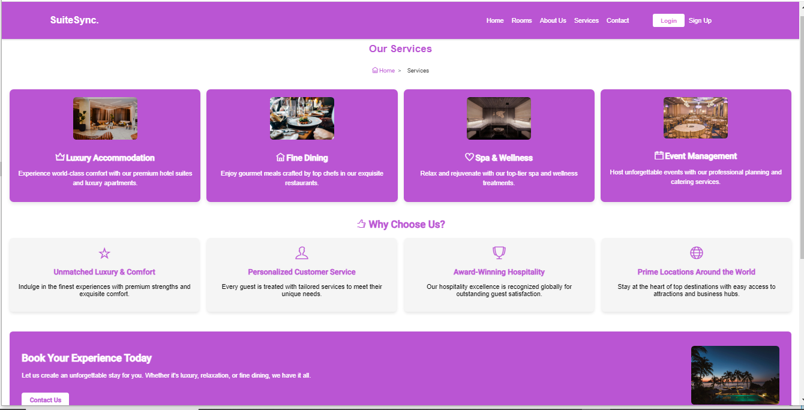
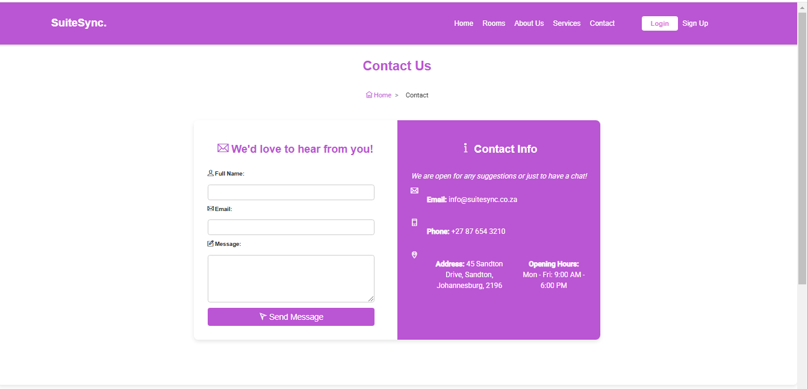

## 🌍Live Demo

This SuiteSync website is live at: [https://fir-6122b.web.app]

## 🏆Contributors

- Mncedisi Masondo
